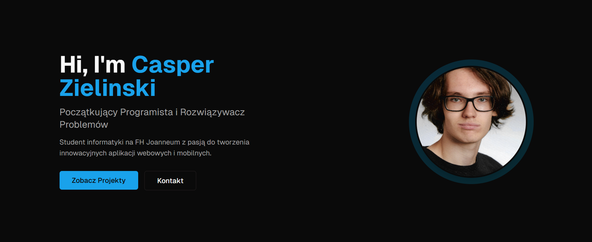

# Casper Zielinski - Portfolio Website

A modern, responsive portfolio website showcasing my skills as an aspiring developer studying at FH Joanneum. Built with cutting-edge web technologies and designed with user experience in mind.

🌐 **Live Demo:** [View Portfolio](https://casperzielinski-portfolio.vercel.app/)



## ✨ Features

- **🌙 Dark/Light Theme Toggle** - Seamless theme switching with system preference detection
- **🌍 Multi-language Support** - Available in English, German, and Polish
- **📱 Fully Responsive Design** - Optimized for all devices (320px and above)
- **🎨 Modern UI/UX** - Clean design with smooth animations and micro-interactions
- **⚡ Fast Performance** - Built with Next.js for optimal loading speeds
- **♿ Accessible** - WCAG compliant with proper semantic markup

## 🛠️ Tech Stack

### Frontend

- **Next.js 14** - React framework with App Router
- **React 18** - UI library with hooks
- **TypeScript** - Type-safe development
- **Tailwind CSS** - Utility-first CSS framework
- **shadcn/ui** - Modern component library

### Tools & Deployment

- **Git & GitHub** - Version control
- **Vercel** - Deployment platform
- **npm** - Package management

## 🎯 Skills Showcased

**Programming Languages:** JavaScript, TypeScript, Java, SQL  
**Libraries & Frameworks:** React, Next.js, Redux, JavaFX  
**Styling:** Tailwind CSS, DaisyUI, Bootstrap CSS  
**Backend Services:** Firebase, Supabase  
**Tools:** Git, GitHub, Maven, npm  

## 🚀 Featured Projects

### 1. Restaurant Website

Modern restaurant website with online ordering system

- **Tech:** Bootstrap, React, TypeScript, Firebase, Express.js
- **Features:** Menu management, order processing, responsive design

### 2. Issue Tracker

Full-stack application for project management and bug tracking

- **Tech:** Next.js, TypeScript, Supabase, shadcn/ui, Tailwind CSS, Radix
- **Features:** Real-time updates, user authentication, advanced filtering

### 3. Social Media App with AI Integration

AI-powered social platform with intelligent content recommendations

- **Tech:** Next.js, TypeScript, Firebase, Redux, shadcn/ui, Tailwind
- **Features:** AI content analysis, real-time chat, advanced user interactions

## 🏃‍♂️ Quick Start

```bash
# Clone the repository
git clone https://github.com/yourusername/portfolio-website.git

# Navigate to project directory
cd portfolio-website

# Install dependencies
npm install

# Start development server
npm run dev

# Open http://localhost:3000 in your browser
```

## 📦 Available Scripts

```bash
npm run dev          # Start development server
npm run build        # Create production build
npm run start        # Start production server
npm run lint         # Run ESLint
npm run type-check   # Run TypeScript compiler
```

## 🎨 Customization

The website is built with modularity in mind:

- **Themes:** Modify colors in `tailwind.config.js`
- **Content:** Update personal information in `src/lib/data.ts`
- **Components:** Reusable components in `src/components/`
- **Translations:** Language files in `src/lib/translations/`

## 📱 Responsive Breakpoints

- **Mobile:** 320px - 768px
- **Tablet:** 768px - 1024px  
- **Desktop:** 1024px+

## 🌟 Performance

- ⚡ **Lighthouse Score:** 95+ on all metrics
- 🎯 **Core Web Vitals:** Optimized for speed and user experience
- 📦 **Bundle Size:** Minimized with code splitting

## 🎓 About Me

I'm Casper Zielinski, a passionate developer studying at FH Joanneum with a focus on modern web technologies. I enjoy creating user-friendly applications that solve real-world problems.

**Contact:** casper.zielinski.work@gmail.com

## 📄 License

This project is open source and available under the [MIT License](LICENSE).

---

⭐ **Like this project?** Give it a star and feel free to fork it for your own portfolio!

**Built with ❤️ by Casper Zielinski**
