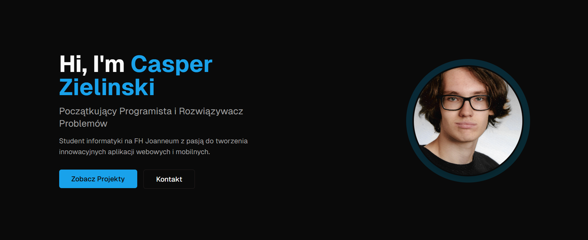

# Casper Zielinski - Portfolio Website

A modern, responsive portfolio website showcasing my skills as an aspiring developer studying at FH Joanneum. Built with cutting-edge web technologies and designed with user experience in mind.

**Live Demo:** [View Portfolio](https://casperzielinski-portfolio.vercel.app/)



## Features

- **Dark/Light Theme Toggle** - Seamless theme switching with system preference detection
- **Multi-language Support** - Available in English, German, and Polish
- **Fully Responsive Design** - Optimized for all devices (320px and above)
- **Modern UI/UX** - Clean design with smooth animations and micro-interactions
- **Fast Performance** - Built with Next.js for optimal loading speeds
- **Accessible** - WCAG compliant with proper semantic markup

## Tech Stack

### Frontend

- **Next.js 14** - React framework with App Router
- **React 18** - UI library with hooks
- **TypeScript** - Type-safe development
- **Tailwind CSS** - Utility-first CSS framework
- **shadcn/ui** - Modern component library

### Tools & Deployment

- **Git & GitHub** - Version control
- **Vercel** - Deployment platform
- **npm** - Package management
- **v0** - AI website builder used to kickstart the project
- **Claude Code** - AI coding assistant used during development

## AI Assistance

This portfolio was built with the help of AI. The project was kickstarted with v0, Vercel's AI website builder, and then developed further with Claude Code, Anthropic's AI coding assistant, which I used for parts of the website, such as components, translations and documentation. I directed the work, reviewed the results and made the design and content decisions myself.

## Skills Showcased

**Programming Languages:** TypeScript, Java, Python, Kotlin, SQL  
**Frameworks and Libaries:** Next.js, React, Express.js, Node.js, Spring Boot
**Mobile:** Capacitor, Jetpack Compose   
**Databases and Backend Services:** Firebase, Supabase, PostgreSQL  
**Tools:** Git  

## Featured Projects

### 1. SmartKassa

RKSV-compliant cash register and ride management system for Austrian taxi companies, with a native mobile app.

- **Tech:** React, TypeScript, Tailwind CSS, Node.js, Express.js, PostgreSQL, Capacitor
- **Links:** [Live](https://smart-kassa.vercel.app/) | [Code](https://github.com/zynqly-smartkassa/smart-kassa)

### 2. Social Media Web App

Interactive social platform with real-time posts, comments, nested replies and live like updates.

- **Tech:** Next.js, React, TypeScript, DaisyUI, Tailwind, Firebase, Redux
- **Links:** [Live](https://social-media-web-app-weld.vercel.app/) | [Code](https://github.com/casper-zielinski/Social-Media-Web-App)

### 3. Issue Tracker

Project management tool for tracking issues, bugs and tasks with statuses, priorities and user assignments.

- **Tech:** Next.js, React, TypeScript, Supabase, DaisyUI, Tailwind CSS
- **Links:** [Live](https://issue-tracker-pearl-alpha.vercel.app/) | [Code](https://github.com/casper-zielinski/Issue-Tracker)

### 4. Taverna Luna (Restaurant)

Restaurant website with an online menu and table reservations, backed by a REST API for reservations, tables and customers.

- **Tech:** React, TypeScript, Vite, Bootstrap, React Router, Axios, Java, Spring Boot, Spring Data JPA, PostgreSQL
- **Links:** [Live](https://restaurant-bootstrap-gamma.vercel.app/) | [Frontend](https://github.com/casper-zielinski/Restaurant-Bootstrap) | [Backend](https://github.com/casper-zielinski/Restaurant-Bootstrap-Backend)

### 5. Blink

Native Android social media app built with Jetpack Compose and Material Design 3 for the "Mobile Platforms" course at FH JOANNEUM.

- **Tech:** Kotlin, Jetpack Compose, Material Design 3, Android, Firebase, Cloudinary
- **Links:** [Code](https://github.com/casper-zielinski/Blink-Social-Media-App)

## Quick Start

```bash
# Clone the repository
git clone https://github.com/yourusername/portfolio-website.git

# Navigate to project directory
cd portfolio-website

# Install dependencies
npm install

# Start development server
npm run dev

# Open http://localhost:3000 in your browser
```

## Available Scripts

```bash
npm run dev          # Start development server
npm run build        # Create production build
npm run start        # Start production server
npm run lint         # Run ESLint
npm run type-check   # Run TypeScript compiler
```

## About Me

I'm Casper Zielinski, a passionate developer studying at FH Joanneum with a focus on modern web technologies. I enjoy creating user-friendly applications that solve real-world problems.

**Contact:** casper.zielinski.work@gmail.com

## License

This project is open source and available under the [MIT License](LICENSE).

---

**Like this project?** Give it a star and feel free to fork it for your own portfolio!

**Built by Casper Zielinski, kickstarted with v0 and developed with Claude Code**
